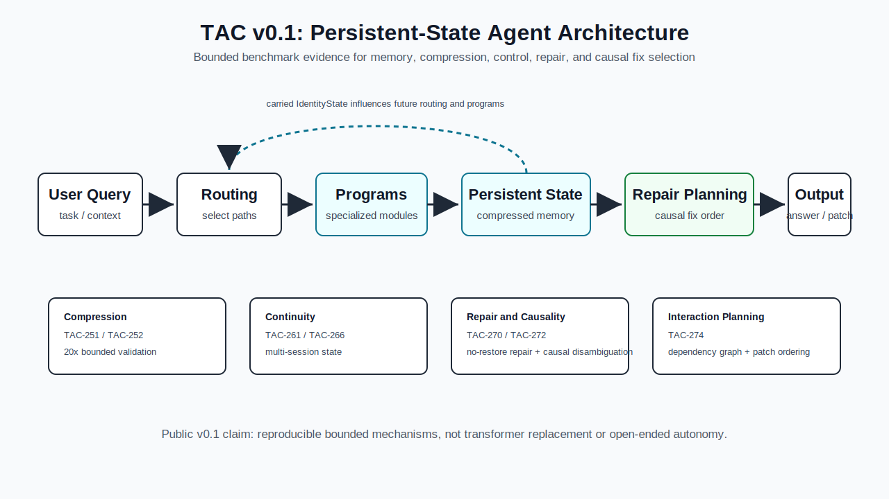

# TAC v0.1 Architecture Diagram



## Reading The Diagram

TAC v0.1 should be understood as a bounded research asset for persistent-state
agent architecture, not as a claim of transformer replacement.

The central flow is:

```text
User Query
  -> Routing
  -> Programs
  -> Persistent State
  -> Repair Planning
  -> Output
```

Benchmark annotations:

- TAC-251 and TAC-252 support the compression path.
- TAC-261 and TAC-266 support multi-session continuity.
- TAC-270 supports no-restore multi-file repair in sandboxed repository slices.
- TAC-272 supports causal fix disambiguation under bounded ambiguity.
- TAC-274 supports interaction-aware repair planning with dependency graphs and patch ordering.

Current public claim:

> TAC is an experimental persistent-state architecture for long-horizon AI
> agents, with validated mechanisms for memory, compression, control, repair,
> and causal fix selection in bounded benchmarks.

Current limitation:

TAC v0.1 does not prove open-ended autonomous software engineering, transformer
superiority, or large-scale pretrained-model survival.
